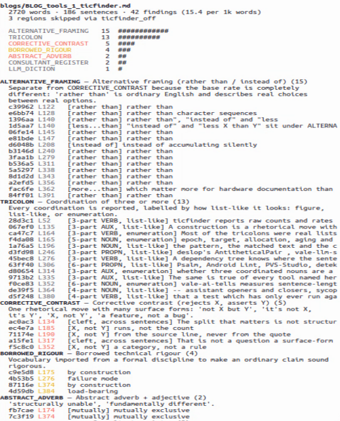
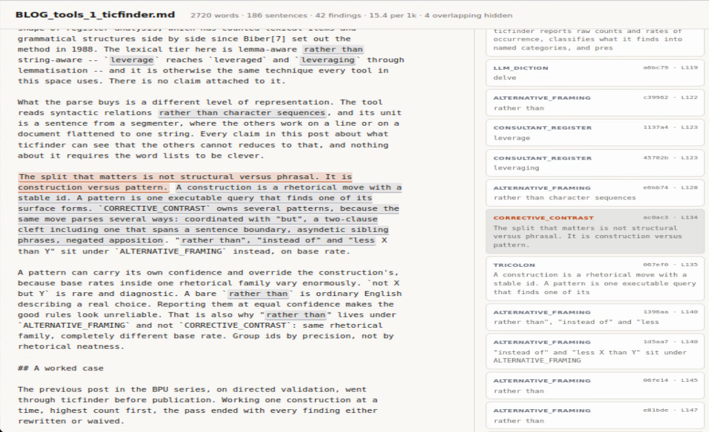

<!-- SPDX-License-Identifier: CC-BY-4.0                        -->
<!-- Copyright (c) 2026 Jeff Nye, uarchlabs.com                -->
<!-- SPDX-FileCopyrightText: 2026 Jeff Nye <jeff@uarchlabs.com>  -->

```
TITLE:     "ticfinder: Finding the Shape of Generated Prose"
FILE:      BLOG_tools_1_ticfinder.md
AUTHOR:    Jeff Nye
DATE:      2026-09-08
STATUS:    DRAFT
COPYRIGHT: "Copyright 2026 Jeff Nye"
```

<!--
---

::SERIES DESCRIPTION::
::BEGIN LINKS::
::END LINKS::
-->

# ticfinder: Finding the Shape of Generated Prose

## Abstract

<!-- ticfinder_off -->
ticfinder is a tool for identifying prose constructions common in LLM
generated text. I find that when editing the first draft of a document I
spend more time than I want tracking down LLM tics in order to rewrite
them. These tics are well known, beyond em-dashes: "it's not X, it's Y",
throat clearing, "an X wrapped in a Y trenchcoat", excessive use of
three-part phrases.
<!-- ticfinder_on -->

However ticfinder is not an AI-detector defeat tool.

The motivation for ticfinder is that these tics are distracting.
ticfinder helps me filter these distractions so I can assess whether my
specification or article is conveying the information accurately, and
putting the emphasis where I want it.

This is a common problem and there are several other tools in this vein,
with differences in approach. Some are built on top of Vale[1] and
supply style packages built on regular expressions. You may find these
useful, see [References](#references).

ticfinder parses markdown with spaCy[2] and reports the rhetorical
constructions that cluster in generated prose. Typical examples are three-part
coordination [JEFF], corrective contrast[ANSC], participial tails
(supplementive clauses) [KORT], and emphatic reflexives(intensifiers) [KONIG].

ticfinder reports raw counts and rates of occurrence. It classifies what it
finds into named categories. Results are presented as a text report and
a graphic view using annotated HTML. 

ticfinder supports a waiver mechanism. Findings you have read and accepted are
recorded and drop out of later runs, the reported count then becomes
those findings that have not been triaged.

What follows is a discussion on how the detection works, what a parse finds
that a regular expression cannot, what the neighbouring tools cover that ticfinder does not, and a short list of what is possibly novel in ticfinder.

## Why ticfinder exists

To date I have focused Pacino development on specification and LLM generation
of RTL, manual review of the results and periodic status reports in the form of
articles or blogs. The 1st draft of the articles is done in coordination with
the LLM. The LLM makes it efficient to define a reasonable scope for the next
status report and accurately capture the statistics. This is done from session
logs and other collateral, and interactively as I set the emphasis/topics for
the next report.

Reporting progress is always a balance between accuracy and detail level and
time spent away from RTL generation. The LLM helps in ensuring accuracy of
stats and file references.

The review and rewrite effort will grow dramatically once Pacino's front end
it complete and I transition from machine focused planning documents to human
focused specifications and theory of operation. ticfinders purpose is to bring
the scope of the review/rewrite effort back in bounds.

The problems with LLM generated prose is well recognized, and the industry
expects the problem to grow. A study[3] of 28,415 PubMed abstracts found
LLM-associated marker use rising from 4.995 to 11.658 per thousand words after
2022, a 133% increase, while control vocabulary declined. A separate study[4]
identified 280 excess style words in published scientific text. To distinguish, both of these studies counted words.

Counting structures is a newer idea and is what ticfinder and others implement.

[5] detects AI-generated text from dependency relation labels alone,
deliberately discarding lexical content, and shows that syntactic structure can
be used to capture LLM artifacts.

In [6] 467,985 were scored against Biber's [BIBER1] sixty-seven
lexicogrammatical features and found past participial clauses among the five
features LLMs most overuse, which is `PARTICIPIAL_TAIL` under its linguistics
name.  The constructions in this post are register markers that linguistics has
had vocabulary for since 1988, produced at rates a human register does not. 

That is the premise ticfinder works from used to a different end. The
research classifies documents. This tool marks sentences and phrasing
structures supporting final review by an editor.

## What ticfinder reports

A ticfinder run prints a header, a count table, and the findings grouped by
construction. A run can optionally emit annotated html. I find myself mostly
using the annotated html, which also shows the raw markdown.

Example report header:
```
lorem_ipsum.md
  2788 words · 189 sentences · 35 findings (12.6 per 1k words)
  1 waived, 2 stale [lorem_ipsum.waivers.json]
    05fe14  was L148  ALTERNATIVE_FRAMING: rather than
    071efa  was L143  ALTERNATIVE_FRAMING: rather than...
  3 regions skipped via ticfinder_off

  ALTERNATIVE_FRAMING   13  ############
  TRICOLON              11  ##########
  CORRECTIVE_CONTRAST    5  #####
  BORROWED_RIGOUR        4  ####
  ABSTRACT_ADVERB        2  ##

  ...etc...
```


Constructions come in two tiers. Structural ones are functions over a
dependency parse: `CORRECTIVE_CONTRAST`, `NEG_ESCALATION`, `ABSTRACT_ADVERB`,
`EMPHATIC_REFLEXIVE`, `PARTICIPIAL_TAIL`, `TRICOLON`, `DISGUISE_METAPHOR`,
`ALTERNATIVE_FRAMING`. Lexical ones are token patterns and word lists:
`FRAME_MARKER`, `HOLLOW_BOOSTER`, `CLOSER`, `EM_DASH`, `HEDGE_STACK`, and the
phrase groups carried in a JSON file.

The tiers are unequal. Structural detectors produce most of the findings on the
documents I have run so far; the word lists catch diction the parse cannot,
since two verbs in the same syntactic slot look identical to a dependency query
even when one is `delve` and the other `examine`. Counting lexical items and
grammatical structures side by side is standard procedure in register
analysis[BIBER2].

What the structural tier provides is a different level of representation. The
structural detectors read syntactic relations preferred over character
sequences, and the tool works on sentences from a segmenter, where other tools
work on a line or on a document flattened to one string. Every claim in this
post about what ticfinder can see that other tools cannot reduces to that, and
nothing about it requires the word lists to be clever.

The split that matters is construction versus pattern: a construction is a
rhetorical function that can be realized several ways, and a pattern is one
executable query that finds one of those realizations. `CORRECTIVE_CONTRAST`
has several patterns, because the same function surfaces several ways:
coordinated with "but", a two-clause cleft including one that spans a sentence
boundary, asyndetic sibling phrases, negated apposition. `rather than`,
`instead of` and `less X than Y` sit under `ALTERNATIVE_FRAMING` instead.

A pattern can carry its own confidence and override the construction's, because
base rates inside one rhetorical family differ widely. `not X but Y` is rare
and diagnostic. A bare `rather than` is ordinary English describing a real
choice.  Reporting them at equal confidence makes the good rules look
unreliable. That is also why `rather than` lives under `ALTERNATIVE_FRAMING`
and not `CORRECTIVE_CONTRAST`: same rhetorical family, completely different
base rate.  Group ids by precision, not by rhetorical neatness.

## Example screen shots

### Detailed findings report



### Annotated HTML




## An example ticfinder rewrite session

A previous post in the Pacino BPU series went through ticfinder before
publication. The first run reported 78 findings. The published version reports
39, all of them waived, with nothing left untriaged.

The waived findings
```
TRICOLON             26
ALTERNATIVE_FRAMING  6
CORRECTIVE_CONTRAST  4
BORROWED_RIGOUR      2
ABSTRACT_ADVERB      1
```

That table is the final waiver count and their catagories. It is not a
breakdown of the original 78. Rewriting removed most of the original findings.

<!-- ticfinder_off -->
NOTE: <em>TRICOLON classification is a well known LLM tell, but it is also
common in natural human speech; we humans love our rule of three.

The numbers above are from one version of ticfinder and they will change.
TRICOLON has some recent findings in literature [BAKH]. I am working on
TRICOLON capture based on this new literature.</em>
<!-- ticfinder_on -->

Back at the original 78, I worked one construction at a time, highest count
first. The rewrites that mattered were the participial tails. A representative
one:

    In BP-045 it went further and contradicted the task itself,
    deriving the three-index bus requirement from the CTR update
    rules and reporting the prompt's single-index assumption as
    wrong.

became

    In BP-045 it went further and contradicted the task: it derived
    the three-index bus requirement from the CTR update rules and
    reported the prompt's single-index assumption as wrong.

The tail expressed the actual finding, and promoting it to a main clause
subjectively improved clarity and flow. All six `PARTICIPIAL_TAIL` and all four
`EMPHATIC_REFLEXIVE` findings were rewritten the same way, which is why neither
construction appears in the closing count. The remaining rewrites were spread
across the other constructions and went much the same way. I have not itemized
them.

My process was to walk through the high count, high confidence findings and
then reassess. About 39 findings remained, the majority being TRICOLON. These
are abused by LLMs but also very common in natural human text. The manifest in
lists with three or more members. 

This TRICOLON finding, "The epoch, target, allocation, aging and
prediction-side paths had not...", names five paths in a section of the source
document specifically about which RTL paths had been checked. It is an
enumeration; no rewrite significantly improved clarity. ticfinder reports it to
ensure it is reviewed.

Two practical notes. First, rewriting a document introduces findings as well as
removing them. Second, the waiver hashes cover the sentence containing each
match, so rewriting a sentence can turn a waiver stale hile edits elsewhere in
the document leave it intact. The ticfinder README describes how waiver hashes
are formed.

## The unit of a waiver

A waiver is keyed to the sentence the construction sits in, not to a
line number and not to the matched phrase on its own. That is the same
grain the detector works at, for the same reason: `rather than` is a
tic in one sentence and a real choice in the next, so the phrase by
itself is not something a reader can accept or reject. What gets
recorded is a judgment about a construction in a context, and the
sentence is the smallest unit that carries the context.

Two consequences follow, and the README has the detail. Rewrapping a
paragraph keeps a waiver, while rewriting the sentence turns it stale,
which is why the waive list is taken from one clean run at the end
rather than as you go. And stale waivers are reported rather than
dropped, so the number a run prints is the number nobody has looked at
yet: zero means reviewed, not clean.

## The neighbours

Prose linting is old. proselint[8] carries 70-plus checks and matches
against dictionaries and regular expressions; the diacritical-marks
check is a straight lookup table. write-good[9] calls itself a naive
linter and builds regexes. Vale has twelve rule extension points, of
which exactly one, `sequence`, touches linguistics at all, reading
part-of-speech tags a sentence at a time. None of the three parses.

Closer to home, there is a cluster of Vale style packages aimed
squarely at LLM prose, and they got there independently.

| project | scale | detection |
|---|---|---|
| vale-ai-tells[10] | largest, well over a hundred rules | overwhelmingly `existence`, a handful of `script` and `sequence` |
| deslop[11] | a few dozen rules | `existence`, `occurrence`, `substitution` |
| vale-llm-slop[12] | a couple of dozen rules | `existence`, with some `sequence` |
| slopster[13] | a handful, plus an agent skill and a diff tool | `existence`, `substitution` |
| ticfinder[14] | a dozen constructions and a phrase file | dependency parse plus token matcher |

Rule counts move whenever those repositories move, so the table gives
the shape rather than a census. The proportions are the durable part: in
the largest of them, the overwhelming majority of rules are `existence`,
which is regex.

The taxonomies converge to a degree that is hard to dismiss. deslop has
a rule named `BorrowedRigor`; I have a construction named
`BORROWED_RIGOUR`, and neither of us knew about the other. deslop's
`AntitheticalPair`, vale-llm-slop's `NegativeParallelism`,
vale-ai-tells' `ContrastiveNegation` and my `CORRECTIVE_CONTRAST` are
one construction under four names. `HedgeCascade` is `HEDGE_STACK`.
`HollowCloser` is `CLOSER`. `OpenerCliche` is `FRAME_MARKER`. All five
projects have an em-dash rule.

None of this was coordinated. Four of the five projects were published
before I knew any of them existed, and the overlap lies in which
constructions they name; the rule wording differs everywhere.

## Regex against a parse

The clearest comparison available is the tricolon, because
vale-ai-tells and ticfinder both detect it and the implementations
could not be less alike.

vale-ai-tells uses a couple of dozen hand-written regular expressions:
gerund, past tense, third person, base form after a modal, base form
after a pronoun subject, shared infinitive, repeated infinitive and
post-colon, each crossed with syndetic and asyndetic forms and with
"and" against "or", plus a negative lookbehind that exempts Conventional
Commits subjects. The file's own comment explains the hardest part:

> Vale flattens a document to a single string before matching, joining
> paragraphs with spaces, so a gap that allowed a period would let three
> clauses drawn from three separate sentences read as a series. That is
> how a slop paragraph of six short sentences used to report a tricolon
> it never contained.

That failure mode does not exist over a parse. A dependency tree knows
where the sentence ends and which tokens are conjuncts of which head,
so three-part coordination is one detector, and it reports whether the
coordination is of verbs, nouns or auxiliaries as a subtype rather than
as a separate rule. The same holds for corrective contrast:
vale-ai-tells' `ContrastiveNegation` is two regexes whose comment
concedes it "will also catch a literal 'coffee, no sugar'".

The Vale packages are not unlinguistic. Their `sequence` rules read
part-of-speech tags, and word lists are lexicography. What Vale fixes
for its rulesets is the level of representation, and that is the whole
of the difference. Its only linguistic extension point reads
part-of-speech tags, so a rule that needs to know what is coordinated
with what has to enumerate surface forms. Given that constraint,
twenty-four regexes and a lookbehind is good engineering.

The cost of the parse is the opposite one. spaCy's `md` model is a
dependency on every run, parse quality is the ceiling on precision, and
where the parse is wrong the finding is wrong. Masked inline code
degrades the parse locally, which is why the quoted text misleads.

## What is actually new

Very little, and it is worth being specific about which little.

Not new: prose linting. Not new: flagging LLM constructions -- four
other projects, one with ten times the rule count. Not new: the insight
that structure beats vocabulary as a signal, which the detection
literature reached first and tested properly. Not new: content-hash
suppression, which is standard practice in code analysis[15], where
Psalm, Android Lint, PVS-Studio, detekt, SonarQube and Semgrep all hash
warning fields precisely because line numbers shift.

What appears to be uncommon, in descending order of confidence:

Detection at the level of syntactic structure rather than surface form,
in a tool meant for editing. The detection research parses; the editing
tools match surface forms. ticfinder sits in between. The tricolon
labelling is the clearest case: deciding whether three coordinated nouns
are a rhetorical figure or an ordinary list draws on item count,
determiners, premodifiers, a cue word in the lead-in, and whether the
members are short and of similar length. That is not a question a
surface-form matcher answers badly. It is a question it cannot ask.

The construction-and-pattern hierarchy, with per-pattern confidence
overriding the construction's. The Vale rulesets are flat, and
vale-ai-tells sets every rule to `error`. Owning several patterns under
one stable id is what lets the id survive when surface forms drift, and
what lets one noisy pattern be muted without losing the construction.

A persistent review ledger for prose. None of the four has one.
slopster's `slop-diff` comes nearest. It compares a branch against main
and reports only new findings, and it is immune to line shifts. But that
answers what changed, not what a human has accepted. For a specification
that will be reviewed repeatedly by different people, the second
question is the one that matters.

One caveat sits under all four. None of this is validated. There is no
corpus study behind ticfinder, no precision or recall figure, and no
baseline beyond my own documents. The same is true of every tool named
here, but a claim about levels of representation invites the question,
and the honest answer is that the evidence in this post is worked
examples rather than measurement.

Refusing to render a verdict. ticfinder reports a rate against a
denominator the author controls, and states in its own documentation
that every construction it finds is legitimate English. That is a
design stance rather than a feature, and it is the reason the tool is
usable on a document where six of eight `ALTERNATIVE_FRAMING` hits are
correct.

## What I am taking from the others

Reading four competing implementations produced a longer list of things
to add than of things to claim.

The largest gap is a category, not a rule. vale-ai-tells measures
sentence-length variance, paragraph-length variance, sentence-start
entropy, sentence-start repetition, transition repetition and content
duplication, in Tengo scripts that section a document by heading first.
The signal there is the absence of variance rather than the presence of
a construction, it is the best-supported signal in the stylometry
literature, and ticfinder does not look for it at all. It already
computes the sentence statistics and reports them in its JSON output;
nothing reads them.

After that: anthropomorphism rules, which matter more for hardware
documentation than for prose style, since "the module wants to" is a
precision defect before it is a tell. Chat-artifact tells --
assistant openers and closers, sycophancy, performed candor -- which
leak whenever an assistant drafts specification text. Heading rules,
of which vale-ai-tells has six and ticfinder none. And a set of
constructions the Vale packages implement as regex that would suit a
parse better: pseudo-cleft, shell-noun copula, summative appositive,
stacked anaphora.

The most immediately useful is the least sophisticated. vale-ai-tells
disables its fall-metaphor rules for aviation prose. I have been hand-
waiving `mutually exclusive` and `by construction` on every hardware
document, which is a domain vocabulary problem with a known solution.


## Where this goes

The BPU posts argued that a test which has only ever run against
conforming RTL has unknown detection capability, and that the cheap fix
is to break the design, watch the test fail, and put it back. The
prose analogue is weaker but the same shape: a construction that has
only ever been read by its author has unknown load-bearing capacity,
and the cheap fix is to try the sentence without it.

The tool does not do that. It cannot, and it should not pretend to. It
narrows five thousand words to twenty-two decisions and keeps the
record of how they went. That is the same division of labour as the RTL
work, and it is the reason the tool is now in the loop for Pacino's
documentation rather than only for these posts.

---

## References

<!-- ticfinder_off -->
[1] Vale: A Syntax-Aware Linter for Prose. Errata AI, github.com/errata-ai/vale.
Accessed 8 Sept. 2026.

[2] Honnibal, Matthew, et al. spaCy: Industrial-Strength Natural Language
Processing in Python. Zenodo, 2020, https://doi.org/10.5281/zenodo.1212303.

[3] Alani, Noor H. S., Jansen, Bernard J., "Are Scientists Starting to Sound
like ChatGPT? Stylistic Diffusion in Biomedical Abstracts in the LLM Era."
Machine Learning and Knowledge Extraction, vol. 8, no. 8, 2026,
https://doi.org/10.3390/make8080223.

[4] Kobak, Dmitry, et al. "Delving into ChatGPT Usage in Academic Writing
through Excess Vocabulary." arXiv, 2024, arxiv.org/abs/2406.07016.

[5] Ahmed, Sara, and Tracy Hammond. "DependencyAI: Detecting AI Generated Text
through Dependency Parsing." arXiv, 2026, arxiv.org/abs/2602.15514.

[6] Rallapalli, Swati, et al. "Interpretable Stylistic Variation in Human and
LLM Writing across Genres, Models, and Decoding Strategies." arXiv, 2026,
arxiv.org/abs/2604.14111.

[7] Biber, Douglas. Variation across Speech and Writing. Cambridge UP, 1988.

[8] Pacer, Michael D., and Jordan W. Suchow. "Linting Science Prose and the
Science of Prose Linting." Proceedings of the 15th Python in Science
Conference, 2016.

[9] Ford, Brian. write-good: Naive Linter for English Prose. 2018,
github.com/btford/write-good. Accessed 8 Sept. 2026.

[10] Bailey, Tim. vale-ai-tells: A Vale Style Package for AI Tells.
github.com/tbhb/vale-ai-tells. Accessed 8 Sept. 2026.

[11] Miller, J. deslop: A Vale Style Package That Flags AI-Slop in Prose.
github.com/JMill/deslop. Accessed 8 Sept. 2026.

[12] vale-llm-slop: Vale Styles That Lint Your Prose.
github.com/Syntaf/vale-llm-slop. Accessed 8 Sept. 2026.

[13] Harris, Todd. slopster: Catch AI Slop in Your Writing before You Publish
It. github.com/t0ddharris/slopster. Accessed 8 Sept. 2026.

[14] Nye, Jeff. ticfinder. uarchlabs, github.com/uarchlabs/ticfinder. Accessed
8 Sept. 2026.

[15] Karpov, Andrey. "Static Analysis: Baseline VS Diff." PVS-Studio, 2020,
habr.com/en/companies/pvs-studio/articles/513952/.

[JEFF] Jefferson, Gail. "List construction as a task and resource." Interaction competence 63 (1990): 92.

[ANSC] Anscombre, Jean-Claude, and Oswald Ducrot. "Deux mais en français?." Lingua 43.1 (1977): 23-40.

[KORT] Kortmann, Bernd. Free adjuncts and absolutes in English: Problems of control and interpretation. Routledge, 2013.

[KONIG] König, Ekkehard, et al. "Intensifiers and reflexives." Reflexives: Forms and functions 40 (2000): 41.

[BIBER1] Rowley-Jolivet, Elizabeth. "Douglas Biber et al., Longman Grammar of
Spoken and Written English. Harlow: Pearson Education Limited, 1999." Les
cahiers de l'APLIUT. Pédagogie et Recherche 21.3 (2002): 91-93.

[BIBER2] Biber, Douglas. Variation across speech and writing. Cambridge
university press, 1991.

[BAKH] Bakhshi, Asim D. "Saying More Than They Know: A Framework for
Quantifying Epistemic-Rhetorical Miscalibration in Large Language Models."
arXiv preprint arXiv:2604.19768 (2026).

## See Also

Lanham, Richard A. A handlist of rhetorical terms. Univ of California Press,
1991.

Alex Contributors. alex: Catch Insensitive, Inconsiderate Writing. 2015,
github.com/get-alex/alex. Accessed 8 Sept. 2026.

Park, Kyumin, et al. "RedPen: Region- and Reason-Annotated Dataset of Unnatural
Speech." arXiv, 2022, arxiv.org/abs/2210.14406.

Perin, Fabrizio, Lukas Renggli, and Jorge Ressia. "Linguistic Style Checking
with Program Checking Tools." Computer Languages, Systems & Structures, vol.
38, no. 1, 2012, pp. 61-72.

Sun, Mingjie, et al. "Idiosyncrasies in Large Language Models." arXiv, 2025,
arxiv.org/abs/2502.12150.

Wikipedia Contributors. "Wikipedia: Signs of AI Writing." Wikipedia,
en.wikipedia.org/wiki/Wikipedia:Signs_of_AI_writing. Accessed 8 Sept. 2026.

<!-- ticfinder_on -->

---

<!-- ticfinder_off -->
*Jeff Nye is a microprocessor architect with 35 years of industry
experience spanning performance modeling, RTL implementation, and
architecture for high-performance OOO processors. He has contributed RTL
to Pentium 4, Arm v7, TI C6x and RISC-V designs, and recently served as
sole architect and full-stack implementer of the TAGE-SC-L + ITTAGE
branch prediction cluster in an 8-issue RVA23 RISC-V processor, from
research through timing closure at 2.75 GHz. He holds more than 20
issued patents in processor design, architecture, and hardware
virtualization. He is the author of Pacino and the uarchlabs methodology
documented here.*

*Connect on [LinkedIn](https://www.linkedin.com/in/jeff-nye-21353926).*
<!-- ticfinder_on -->
